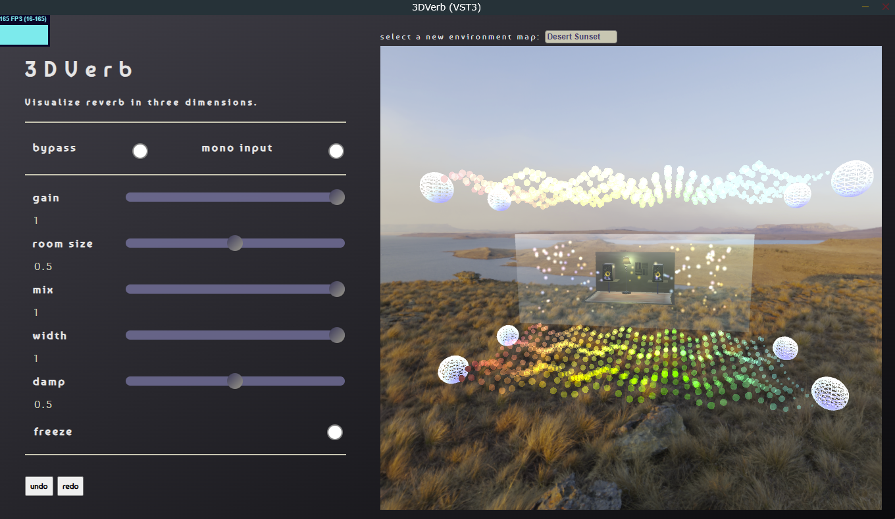
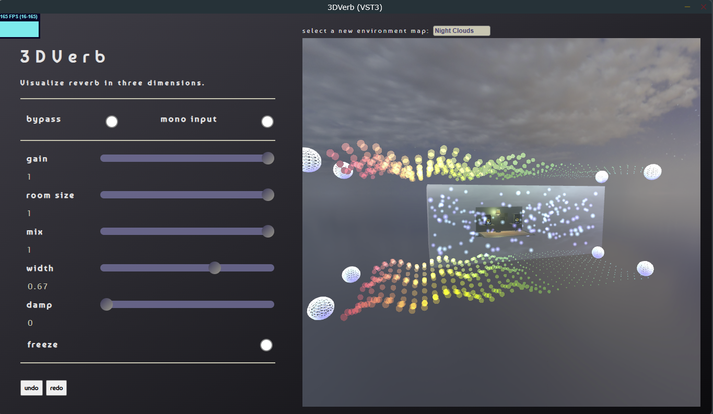
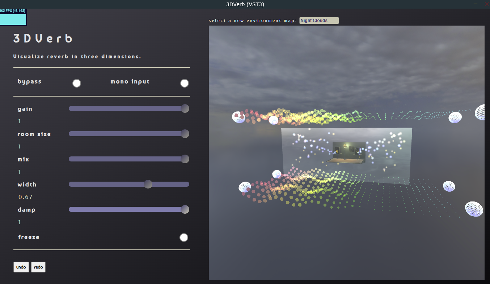
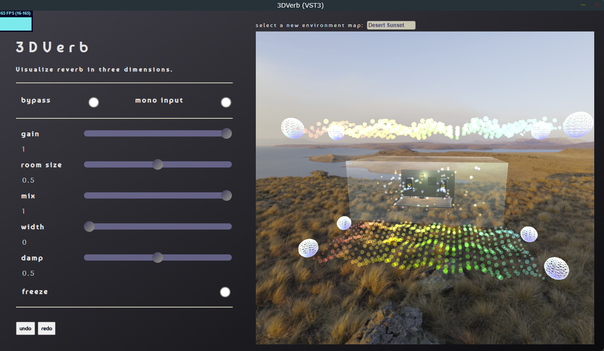
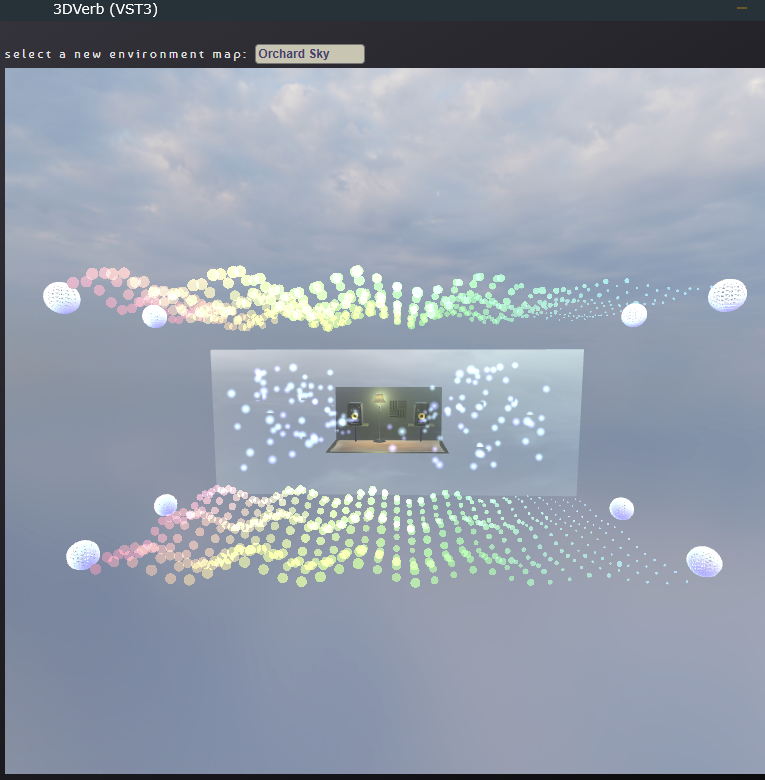

# 3DVerb

## About
- 3DVerb is a VST3 reverb audio plugin made with the JUCE framework.
- 3DVerb utilizes the `juce_audio_basics` module `Reverb` class (`juce_Reverb.h`) as a reference plugin.
- It processes real-time audio data, and passes that data to a JUCE WebView frontend.
- The UI integrates [ThreeJS WebGL animation library](https://threejs.org/) 
and the Three Nebula library [independent library for ThreeJS](https://github.com/creativelifeform/three-nebula) that simplifies certain animations like particle emission.

## Goals
- Proof of concept: audio plugins, enabled by Juce WebView2 for 3D visualizations, can react in real time to real-time data and visualize that data artistically in three dimensions.
- Push for audio plugins to be less utilitarian: Many people utilize their DAW for general music practice and don't necessarily need all their CPU power dedicated to dozens of plugins.
- Provide a relaxing virtual environment for users to visualize their music in real time.
- Practical uses:
    - Demonstrate flexibility of JUCE WebView paradigm for visualization purposes.
    - View how reverb parameters affect frequency distribution in real-time--useful for mixing as reverb can saturate low or high frequencies depending on parameter settings.
    - Visual supplement to music performance.
    - Education: view how reverb algorithm affects frequency data. Visualize how parameter changes affect high frequency attenuation.

## Requirements
- JUCE v8.0.8
- JUCE Projucer
- JUCE AudioPluginHost
- A system with WebView2 runtime installed (if using Windows, this is automatically included in Windows 11). 
- Node JS and Node Package Manager (npm)

## Languages

- C++ 17
- JavaScript
- HTML / CSS

## Installation

### Environment

These instructions developed in the following environment

- Windows 11 Environment
- Projucer
- Visual Studio
- Development machine hardware: 
    - AMD Ryzen 5 3600 6-core CPU
    - AMD Radeon 6600XT GPU
    - 32GB RAM
### Prerequisites

JUCE Framework v8.0.8

### Instructions

1. Clone this repository.
2. Launch JUCE Projucer
    - Load 3DVerb.jucer
    - Click "Save and Open in IDE" to generate Visual Studio `.sln` file.
3. Preparing for debugging in JUCE `AudioPluginHost`. 
    - In Visual Studio Solution Explorer, right-click `3DVerb_VST3`, 
    - Click 'Properties'.
    - Left hand pane: Select `Debugging`.
    - In `Command` section, enter `<YOUR JUCE FRAMEWORK DIRECTORY>\AudioPluginHost\Builds\VisualStudio2022\x64\Debug\App\AudioPluginHost.exe`
    - In `Working Directory` section, enter `<YOUR 3DVERB PROJECT LOCATION>\3DVerb\Builds\VisualStudio2022\x64\Debug\VST3`
4. Prepare Frontend:
    - Navigate to UI directory: cd `3DVerb\Source\UI`.
    - Install dependencies: `npm install`.
    - Launch Vite web server: `npx vite`.
5. Build and run the plugin: `Local Windows Debugger`.
6. Configure AudioPluginHost:
   - In AudioPluginHost, go to Options → Edit the list of available plug-ins
   - Click "Scan for new or updated VST3 plug-ins"
   - Navigate to your build directory: `3DVerb\Builds\VisualStudio2022\x64\Debug\VST3`
   - Select the 3DVerb.vst3 file and add it to the filter graph

### Development Notes

#### TODO

- Installation instructions for CMAKE and macOS users needed.
- Create a production branch.
- Prepare for release by determining WebView requirements and/or updating relevant code to check for environment.

## Features
- Three-dimensional visualization of JUCE reference reverb algorithm [Freeverb implementation](https://www.dsprelated.com/freebooks/pasp/Freeverb.html)
- Utilization of event-driven JUCE WebView paradigm.
- Hot-reload of frontend:
    - decouples visualization development from audio processing development.
    - save time not rebuilding each time the code for visualization is updated.
- Real-time parameter mapping between JUCE AudioProcessor and WebView frontend.
- Thread-safe data exchange using lockless programming techniques.
- Maxed out FPS on a mid-range PC.
- Responsive 3D camera controls using ThreeJS `OrbitControls` extension.
- Frequency-only FFT extracts frequency data for visualization in a "particle wave."
- Visual feedback for reverb tail length and decay characteristics.
- Particle density and behavior controlled by output level and interaction of primary reverb parameters.
- Visualization features extracted from primary params for a reactive real time visualization.
- Interaction with ThreeJS Mesh objects and utilization of Three Nebula initializers and behavior physics.
- Change ThreeJS environment map from a predetermined list.
- JUCE `UndoManager` integration with undo/redo buttons and ctrl+z, ctrl+y keyboard shortcut integration.

## Parameter Mapping

### Primary params of 3DVerb

| Parameter | Type | Range | Default | Step | Description |
|-----------|------|-------|---------|------|-------------|
| Bypass | Bool | 0/1 | false | - | Bypasses the reverb effect |
| Mono | Bool | 0/1 | true | - | Forces mono output processing |
| Gain | Float | 0.0 - 1.0 | 1.0 | 0.01 | Output gain control |
| Size | Float | 0.0 - 1.0 | 0.5 | 0.01 | Room size/reverb decay time |
| Mix | Float | 0.0 - 1.0 | 0.75 | 0.01 | Wet/dry signal balance |
| Width | Float | 0.0 - 1.0 | 0.75 | 0.01 | Stereo width of reverb effect |
| Damp | Float | 0.0 - 1.0 | 0.5 | 0.01 | High frequency damping amount |
| Freeze | Float | 0.0 - 1.0 | 0.0 | 0.01 | (a boolean is set true by range being greater than 0.5) Freezes reverb tail (infinite sustain) |

### Parameter to visualization mapping

| Audio Parameter | Visual Element | Mapping Description |
|----------------|----------------|-------------------|
| Room Size | Particle Spread | Larger values increase particle distribution radius. Radius of emitted particles scales up or down. Surrounding glass cube increases in size |
| Mix | Anchor spheres | Anchor spheres scale up and down |
| Damping | Particle Color | Higher damping (threshold = damping > 0.45) shifts particles toward warmer colors on collision with surrounding cube |
| Damping / Room Size interaction | Particle Density | Controls life of particles inside surrounding cube |
| Frequency Data | Particle Wave Region Height | FFT freq. bins mapped to Y-axis particle positions in a sine wave animation |
| Frequency Data | Particle Wave Scale | FFT freq. bin level controls individual particle scale |
| Freeze Mode | Animation Speed | Freezes particle motion when enabled |

## Demo

- [Link to YouTube demo](https://youtu.be/eGZhZD_gz-U?si=G89zYqrec95ox9tF)

## Screenshots

As this is a dynamic visualization, screenshots are only half the story, but these will give an idea as to how the visualization
responds to parameter changes at a high level.

- damp: 0; room size: 0 
- damp: 0; room size: 1 
- damp: 1; room size: 1 
- damp: 0.5; width: 0 
- width: 1; damp: 0.5 
- damp: 0.4; room size: 0.75; room size: 0.75; mix: 0.61  

## Future expansions

- Allow user to upload custom environment maps.
- Allow user to change emitted sprite from a predetermined list.
    - Allow user to upload custom sprites.
- Enable preset management.
- Implement explanatory tooltips

## Academic Report

For a more thorough discussion of this project, please see [the academic report](docs/academic_report.pdf).

## Acknowledgments
This project was completed as part of my MSCS program at University of Massachusetts Dartmouth
under the guidance of Professor Jiawei Yuan. Special thanks for their supervision throughout the development process.

## Credits

3D Models (All from Sketchfab.com under CC BY 4.0):

    "Fine Persian Heriz Carpet" by mfb64 - https://skfb.ly/o76nI

    "Sound Proofing Dampening Foam" by MiningMark48 - https://skfb.ly/6tsrX

    "Floor Lamp" by bilgehan.korkmaz - https://skfb.ly/OAQK

    "KRK Classic 5 Studio Monitor Speaker" by TheGiwi - https://skfb.ly/6WMwT

Environment Maps:

    Rogland Clear Night: https://polyhaven.com/a/rogland_clear_night

    HDRI Skies: https://hdri-skies.com/free-hdris/

## License
This project is licensed under GPL v3 - see the [LICENSE](LICENSE.md) file for details.

